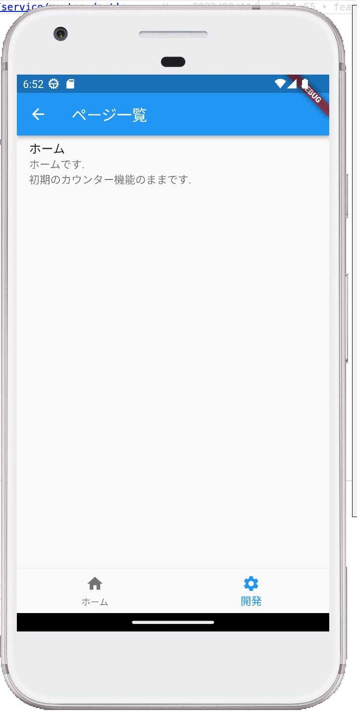

# i3t2

I3T2 is identify the task !

タスクの洗い出しをサポートします !

## Getting Started

This project is a starting point for a Flutter application.

A few resources to get you started if this is your first Flutter project:

- [Lab: Write your first Flutter app](https://docs.flutter.dev/get-started/codelab)
- [Cookbook: Useful Flutter samples](https://docs.flutter.dev/cookbook)

For help getting started with Flutter development, view the
[online documentation](https://docs.flutter.dev/), which offers tutorials,
samples, guidance on mobile development, and a full API reference.

## 紹介

| 画面一覧 | API一覧 | DB一覧 | 機能一覧 |
| --- | --- | --- | --- |
|  |   |   |   | 

### 基底クラス

| 基底クラス名 | 役割 |
| --- | --- |
| `PageBase` | 全ての `page` クラスが継承する. | 
| `ApiBase` | 全ての `API` クラスが継承する. | 
| `ModelBase` | 全ての `Model` クラスが継承する. | 
| `ControllerBase` | 全ての `Controller` クラスが継承する. | 
